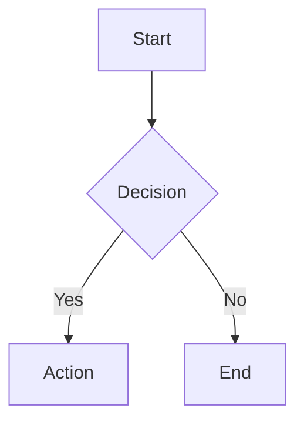
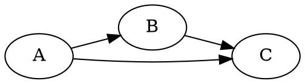
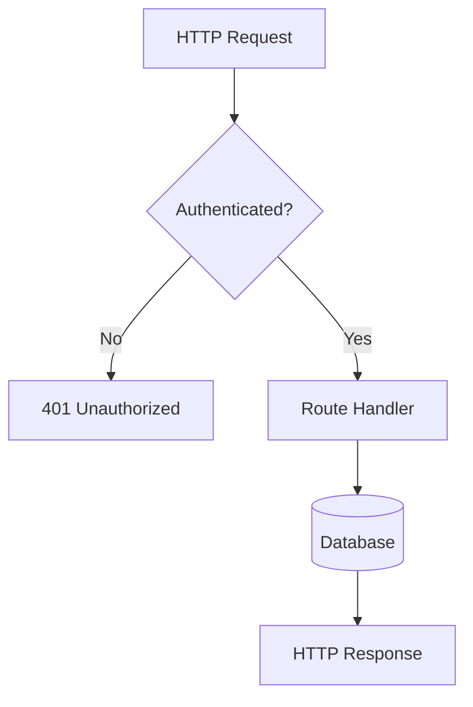
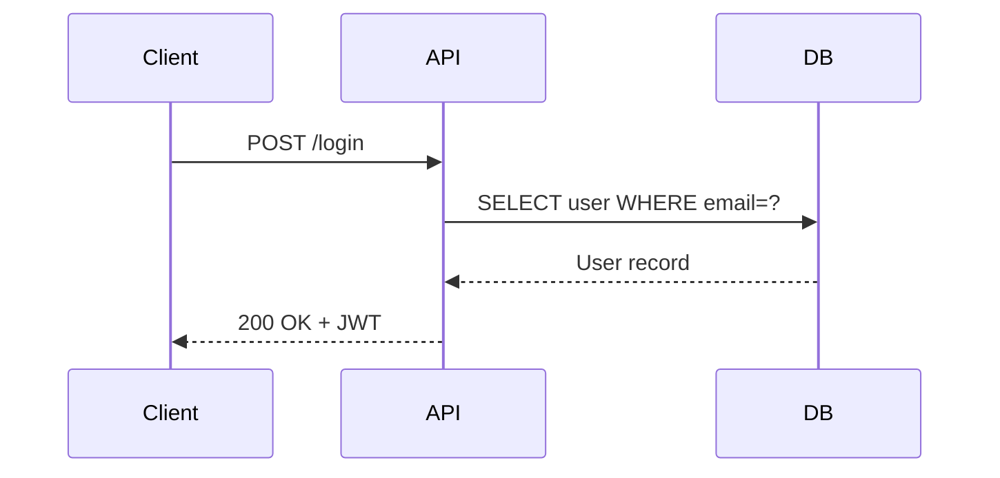
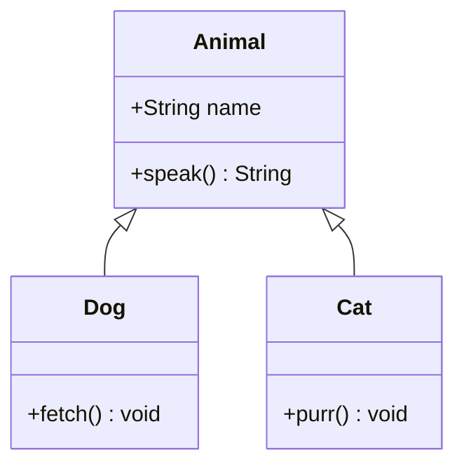
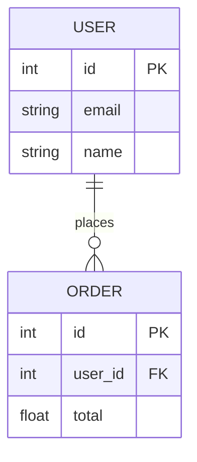
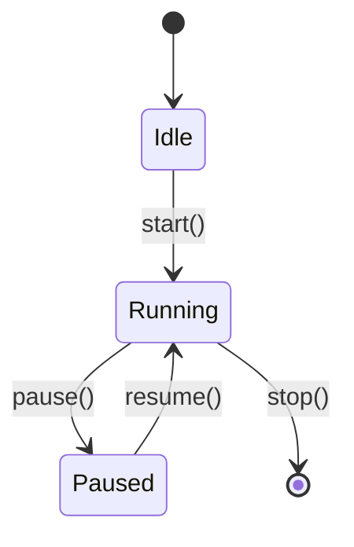

# Graphify

Graphify generates accurate, readable diagrams from code, architecture descriptions, and data relationships. Choose the best format based on what is being visualized and what the user's environment supports.

## Format Selection Guide

### Mermaid (preferred for most cases)
Use Mermaid when the output will be rendered in GitHub, GitLab, Notion, or any Markdown-aware tool. Mermaid supports:

- **Flowchart** (`graph TD` / `graph LR`) — logic flows, decision trees, pipelines
- **Sequence diagram** (`sequenceDiagram`) — API calls, message passing, HTTP flows
- **Class diagram** (`classDiagram`) — OOP hierarchies, interfaces, relationships
- **Entity Relationship** (`erDiagram`) — database schemas, data models
- **State diagram** (`stateDiagram-v2`) — FSMs, lifecycle diagrams
- **Gantt** (`gantt`) — timelines, project schedules
- **C4 diagram** (`C4Context`, `C4Container`) — system architecture

Always wrap Mermaid in a fenced code block:
````

````

### Graphviz DOT
Use DOT format when the user requests it explicitly, or for complex directed/undirected graphs where fine-grained layout control is needed. Wrap in a `dot` code block:
````

````

### ASCII Art
Use ASCII when the user needs a plain-text diagram (terminal output, email, no rendering support). Keep it simple and readable:

```
┌────────────┐     ┌────────────┐
│   Client   │────▶│   Server   │
└────────────┘     └────────────┘
```

## Workflow

### 1. Understand what to graph
- Read referenced files using Read, Glob, and Grep tools to understand structure
- Identify key nodes: classes, functions, modules, services, tables, states
- Identify edges: calls, imports, inheritance, foreign keys, transitions

### 2. Choose the right diagram type

| Subject | Recommended type |
|---|---|
| Function call chains / logic flow | Flowchart |
| API / service communication | Sequence diagram |
| Class / interface relationships | Class diagram |
| Database schema | ER diagram |
| State machine / lifecycle | State diagram |
| Module / package dependencies | Flowchart or DOT |
| System architecture overview | C4 or Flowchart |
| Data transformation pipeline | Flowchart |

### 3. Keep diagrams readable
- Limit to the most important nodes — omit trivial details unless asked
- Use meaningful, short labels (abbreviate long names if needed)
- Add a brief title or caption above the diagram
- Group related nodes using subgraphs where it improves clarity

### 4. Validate syntax
Before presenting a Mermaid diagram, verify the syntax is correct:
- Node IDs must not contain spaces — use underscores or camelCase
- String labels with special characters must be quoted: `A["label (1)"]`
- Arrows must use valid syntax: `-->`, `---`, `-.->`, `==>`, `--text-->`
- `classDiagram` uses `<|--` for inheritance and `..>` for dependency

## Examples

### Flowchart (code logic)


### Sequence diagram (API interaction)


### Class diagram (OOP structure)


### ER diagram (database schema)


### State diagram (lifecycle)


## Tips
- When graphing an entire codebase, focus on the top-level modules or entry points, then offer to zoom in on specific areas
- For large schemas, show only the core tables and their foreign-key relationships
- Always offer to refine or expand the diagram after presenting it
